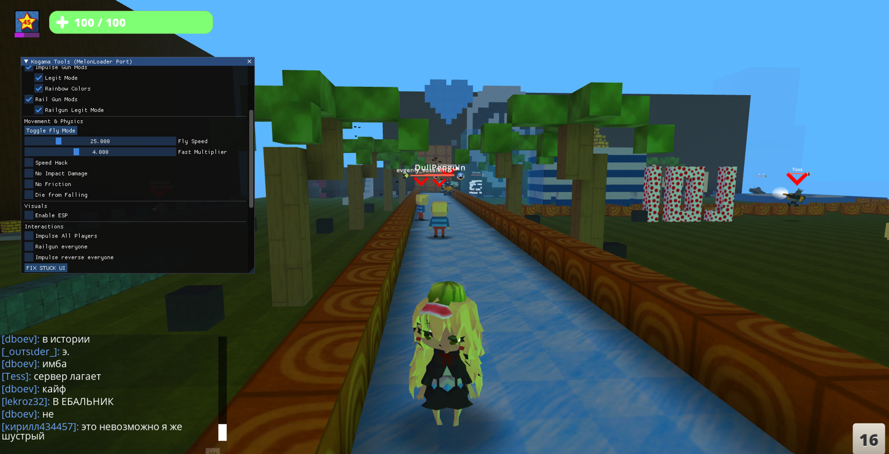
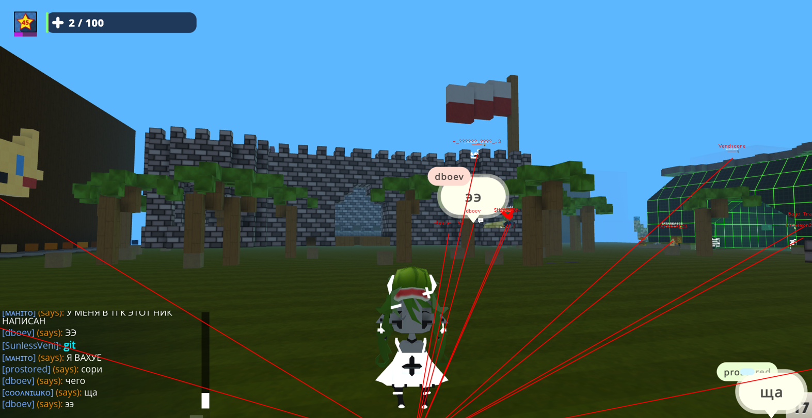
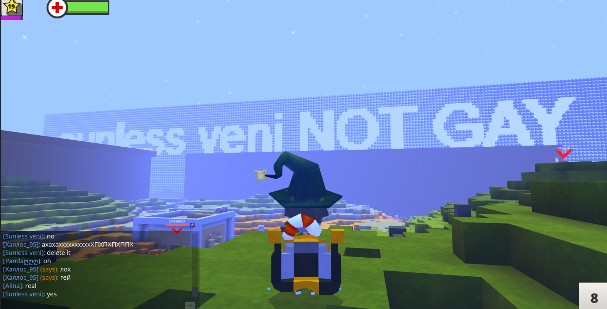
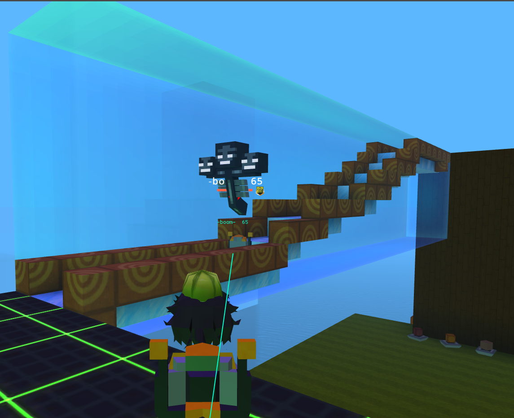
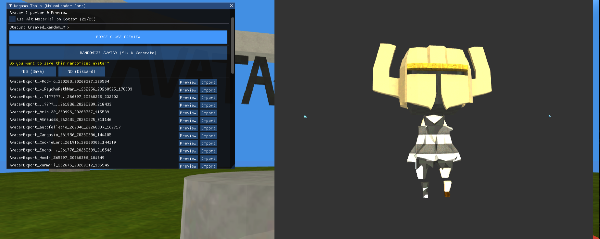
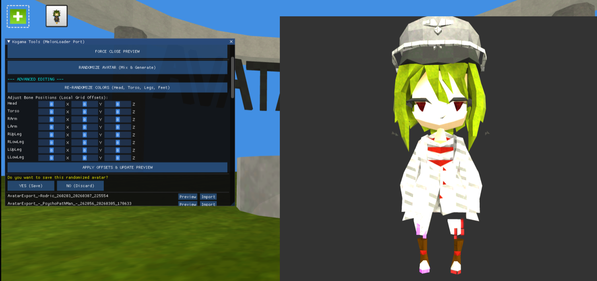

# Kogama-Extra-Cheat
Used template of Beckowl KogamaTools and enhanced it with many new features made by me.
Used also Melonloader.

https://github.com/lavagang/melonloader

https://github.com/Beckowl/KogamaTools

# * I'm not responsible for anything u read there even If ur eyes will burn out. *

This code is mixed with some old functions that i prob wasnt even using anymore but was for pure testing purposes so yall have to figure out which one is correct and everything is in one file so have fun trying to figure out which one to which :^
but yeah you can understand the core functionality of things.
It was really one of my first beginning of deep c# modding. Its really easy and fun and quick. Reading the whole source and then based on it writing function that will do things that your mind is thinking of. Im not c# expert i definitely prefer c++ rather than c# but it was really fun to try it. I still have un-finished things but they wont ever be finished sadly. See you space cowboy!.

https://www.youtube.com/@SunlessVeni

